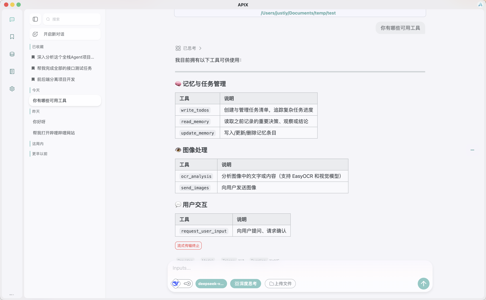
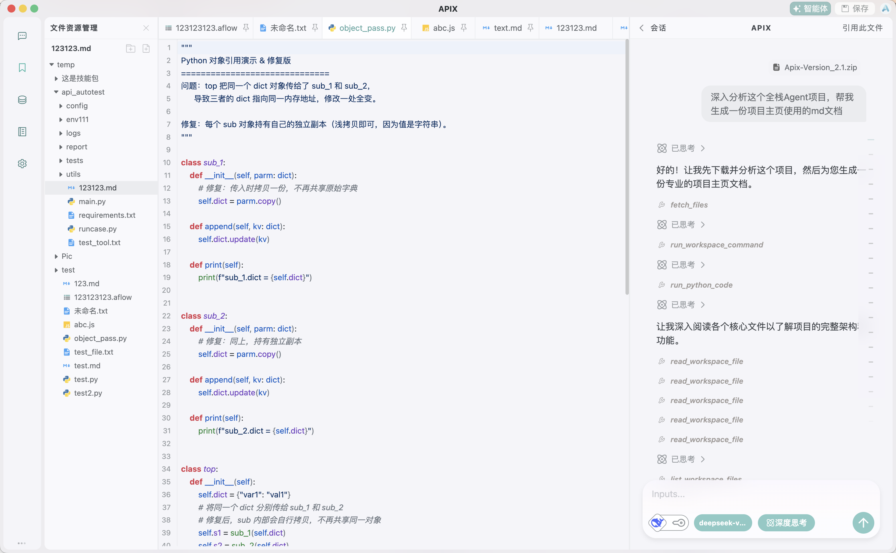
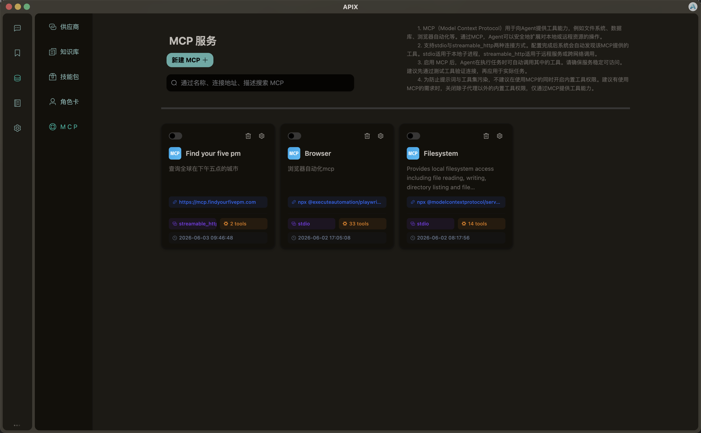
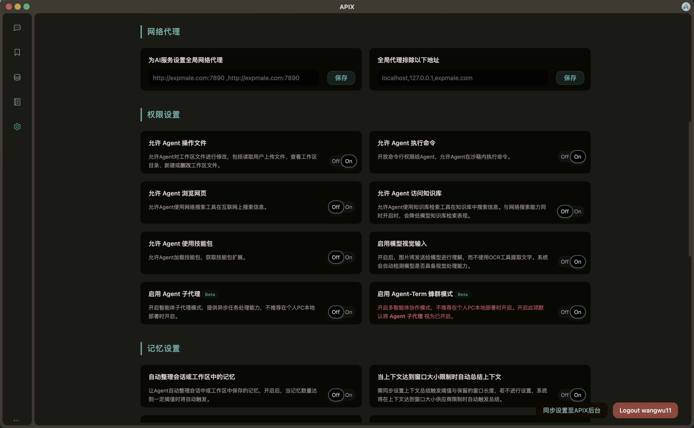

<div align="center">


# APIX — Open-Source AI Agent Operating System

English | [中文文档](./README.md)


[](https://discord.gg/bsTqEzJmJ)


**More than just a chatbot. Build, collaborate, and execute with AI Agents that actually get work done.**

</div>

---

## 🎯 What is APIX?

APIX is a **full-stack AI Agent collaboration platform** designed to provide a complete runtime environment for intelligent agents.

It supports:

* Multi-agent parallel collaboration
* Secure code execution
* Knowledge base retrieval
* Workflow automation
* MCP integration
* Persistent memory management

Whether you're writing code, generating presentations, preparing reports, or building automated workflows, APIX helps transform AI from a conversation tool into a real productivity system.

---

## ✨ Key Features

<table border="1" cellpadding="8" cellspacing="0" style="border-collapse: collapse; width: 100%;">
  <tr>
    <td align="center" width="33%">🤖<br><b>Multi-Agent Collaboration</b><br>Leader agents coordinate multiple worker agents in parallel and automatically decompose complex tasks. Implement Agent file access conflict detection</td>
    <td align="center" width="33%">🔧<br><b>Complete Tool Ecosystem</b><br>Code execution, file management, web search, and knowledge retrieval available out of the box.</td>
    <td align="center" width="33%">🧠<br><b>Advanced Memory System</b><br>Workspace-based memory containers with controllable multi-level context compression.</td>
  </tr>
  <tr>
    <td align="center">🐳<br><b>Secure Code Sandbox</b><br>Docker-isolated execution environment protects your local system from unsafe code.</td>
    <td align="center">🔌<br><b>Multi-Provider LLM Support</b><br>Seamlessly switch between OpenAI, DeepSeek, MoonShot, Ollama, and custom providers.</td>
    <td align="center">🎨<br><b>Custom Workflow Builder</b><br>Design and automate tasks through an intuitive card-based workflow editor.</td>
  </tr>
  <tr>
    <td align="center">👤<br><b>Character Cards</b><br>Create personalized AI assistants with customizable identities and behaviors.</td>
    <td align="center">⚒️<br><b>MCP Compatibility</b><br>Supports multiple MCP transport protocols with customizable session lifecycles.</td>
    <td align="center">💬<br><b>Message Node Management</b><br>Edit or remove any historical message and automatically generate new conversation branches.</td>
  </tr>
</table>

---

## 🖥️ Interface Preview

<table border="0" cellpadding="6" cellspacing="6" style="border-collapse: collapse; width: 100%;">
  <tr>
    <td align="center" width="50%"><b>Chat Interface</b><br></td>
    <td align="center" width="50%"><b>Editor Workspace</b><br></td>
  </tr>
  <tr>
    <td align="center"><b>Resource Management</b><br></td>
    <td align="center"><b>Settings Panel</b><br></td>
  </tr>
</table>

---

## 🚀 Quick Start

### One-Click Installation

#### Windows

Run the following commands in PowerShell:

```bash
Set-ExecutionPolicy Bypass -Scope Process -Force
.\setup.ps1
```

#### macOS / Linux

Run the following commands in your terminal:

```bash
chmod +x setup.sh
./setup.sh
```

> Please ensure that your network connection remains stable during installation.

---

### Custom Installation

If you'd like to customize the deployment process, please refer to our documentation:

* [中文部署文档](./README/README_zh.md)
* [English Documentation](./README/README_en.md)

---

## 🗺️ Roadmap

- [x] Multi-Agent Runtime
- [x] MCP Integration
- [x] Visual Linear Workflow Editor
- [x] Secure Docker Sandbox
- [x] Event loop
- [ ] Scheduled Task Management
- [ ] Plugin and hooks
- [ ] Multi platform support
- [ ] Plugin Marketplace
- [ ] Add missing unit tests
- [ ] Graph-Based Workflow Editor
- [ ] Workspace Time Travel

## 🗺️ Version Log (Version 2.1.1)

- The code related to linear task flow editing is currently broken and will be fixed in a future release. (low)
- Fix incorrect context construction after message node editing.
- Add event loop and event listener mechanism to invoke event handlers non-blockingly by priority.
- Implement automatic tasks and scheduled tasks based on the event loop.
- !!! The next-generation APIX is currently in the works (underlying refactoring).

---

## About APIX 3.0

- Refactoring the underlying Agent Loop
- Cleaner project directory structure
- More flexible system extension points
- Introducing an in-memory database with configurable cache (can be disabled)
- Easier installation and deployment
- More efficient KV-cache hit rate
- Smaller project footprint / fewer dependencies

---

## 📄 License

This project is licensed under the **GNU GPL v3.0 License**.

---

## 🫵 Join Our Community

[QQ Group](https://qun.qq.com/universal-share/share?ac=1&authKey=ommoQrT2zhzHU%2FUxv8pfGCJbNifW%2BJyUAFBkNdzkHTPUxdxCnlgxm5aNgGslTmdE&busi_data=eyJncm91cENvZGUiOiI2Mzk0NTkxNzIiLCJ0b2tlbiI6Im9ZZkdNUWZnSVV1Y2REeUhKNnlTbWEwc05Bb093djRzUXdXNE55dklBVnlBQk9XbGNpS0ZXSDlzK3orSW1sQ3YiLCJ1aW4iOiIzMTI5NDI0NTcyIn0%3D&data=OGTchcr80RAQg8Z8_GZTdvBb7kZDeM9B3hHcNqLaAX2ZK_KYq260C4CubblEBT1bK5fP6zgtnCk2D8fIoph1ZQ&svctype=4&tempid=h5_group_info)
|
[Discord](https://discord.gg/bsTqEzJmJ)

---

🌟 If you find APIX useful, consider giving the project a Star!

> All modules have been tested using ApiFox.
